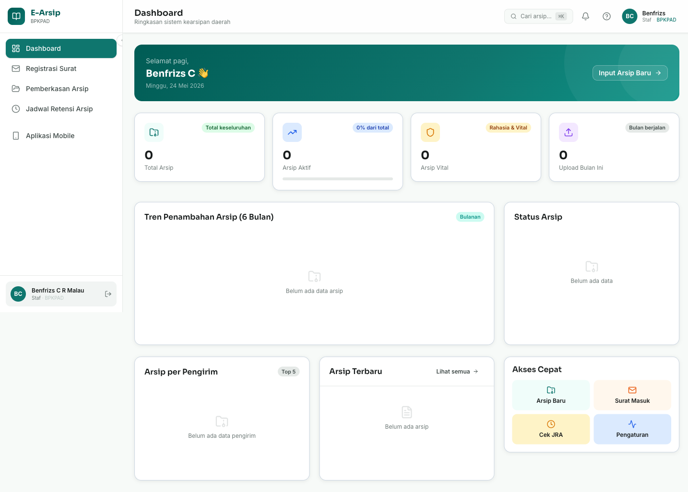
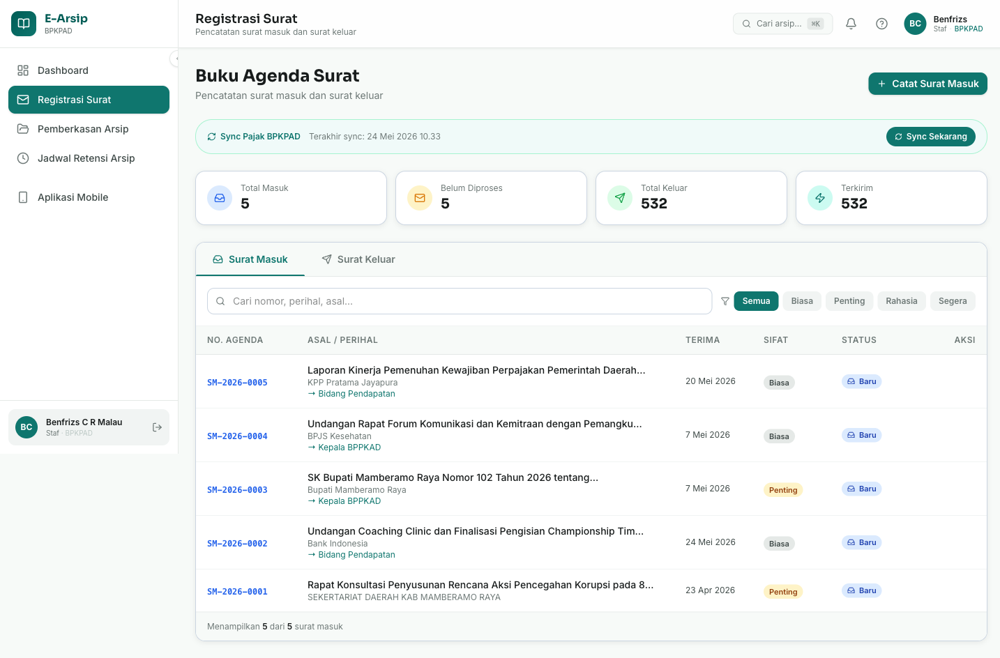
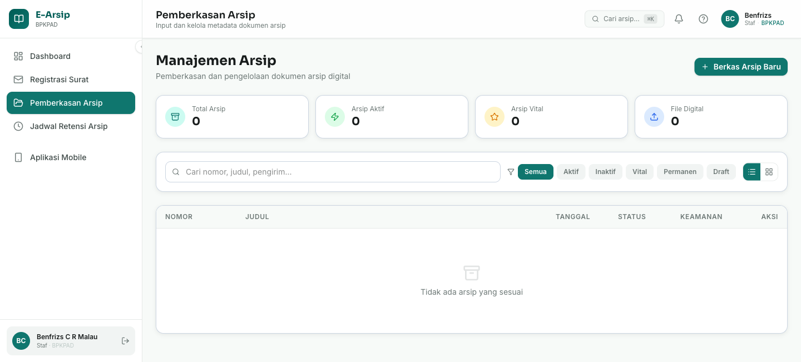
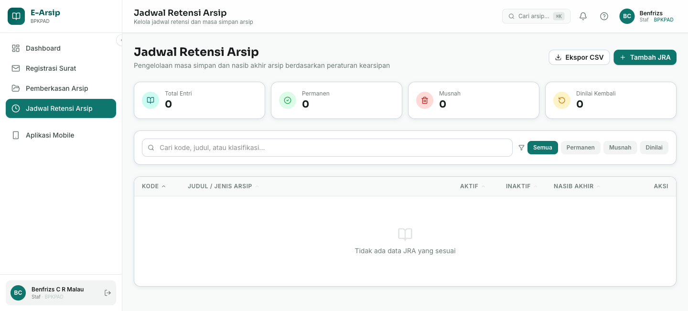
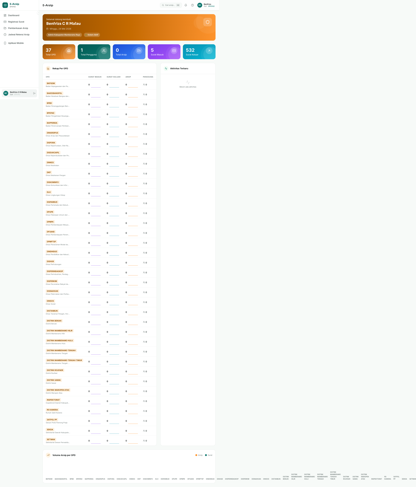
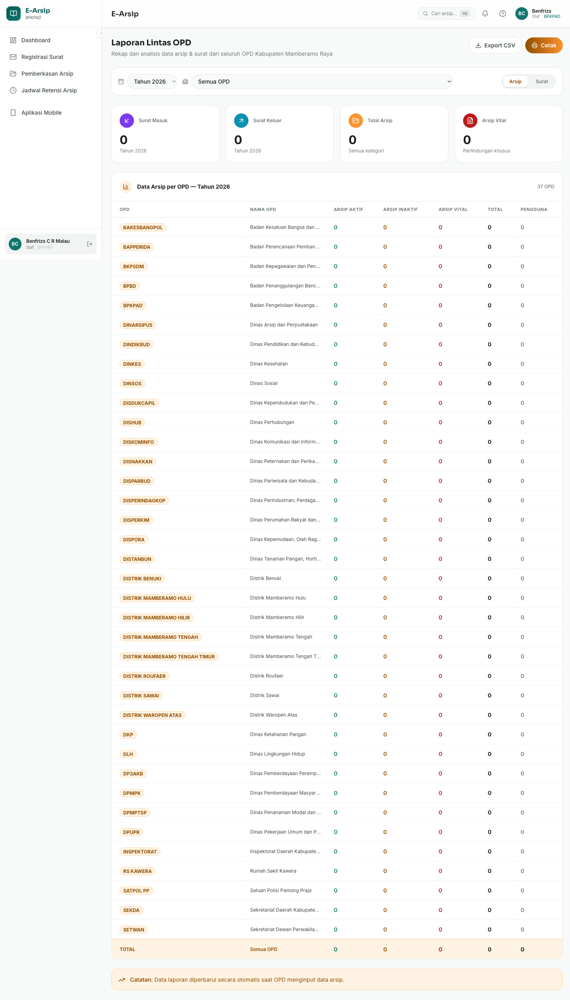

# E-Arsip Mamberamo Raya

Sistem Informasi Manajemen Arsip Digital Pemerintah Kabupaten Mamberamo Raya, Provinsi Papua.

## Fitur Utama

- **Dashboard** — Statistik arsip real-time: total dokumen, arsip aktif, vital, dan upload bulan ini
- **Buku Agenda Surat** — Pencatatan surat masuk & keluar dengan penomoran otomatis; sync otomatis data pajak BPKPAD (SKPD/SKRD/SSPD/SSRD)
- **Manajemen Arsip** — Upload, pencarian, dan pengelolaan dokumen arsip digital
- **Jadwal Retensi Arsip (JRA)** — Pengelolaan jadwal retensi sesuai klasifikasi arsip
- **Laporan** — Rekap arsip per OPD/instansi
- **Admin Panel** — Manajemen pengguna, OPD, dan pengaturan sistem

## Teknologi

| Layer | Stack |
|---|---|
| Frontend | React 19 + TypeScript + Vite |
| Styling | Tailwind CSS + Framer Motion |
| State | TanStack Query + Zustand |
| Backend | Supabase (PostgreSQL + Auth + Storage) |
| Form | React Hook Form + Zod |

## Screenshots

### Halaman Login


### Dashboard


### Buku Agenda Surat


### Manajemen Arsip


### Jadwal Retensi Arsip


### Admin Dashboard


### Laporan


## Instalasi

```bash
# Clone repo
git clone https://github.com/benfrizsmalau/e_arsip.git
cd e_arsip

# Install dependencies
npm install

# Salin dan isi environment variables
cp .env.example .env

# Jalankan development server
npm run dev
```

## Environment Variables

Salin `.env.example` menjadi `.env` dan isi dengan kredensial Supabase:

```env
VITE_SUPABASE_URL=https://your-project.supabase.co
VITE_SUPABASE_ANON_KEY=your-anon-key

# Opsional: untuk sync data pajak BPKPAD
VITE_EXT_SUPABASE_URL=https://your-external-project.supabase.co
VITE_EXT_SUPABASE_SERVICE_KEY=your-service-role-key
```

## Build Production

```bash
npm run build
```

---

© 2026 Pemerintah Kabupaten Mamberamo Raya
